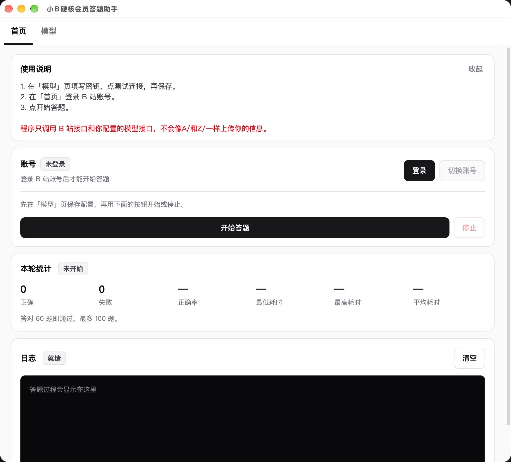
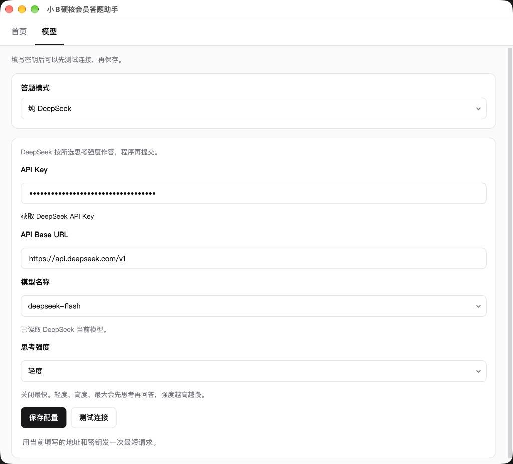
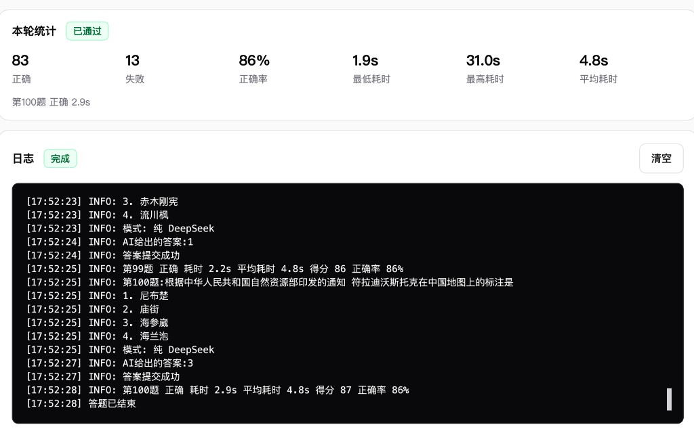

# 小B硬核会员答题助手

B 站硬核会员试炼的桌面答题工具。登录账号后，程序拉题、调用你配置的模型选出选项序号，再提交给 B 站。

基于原仓库 [bilibili-AIHardcore](https://github.com/NekoMirra/bilibili-AIHardcore) 改过界面和答题流程。

[](LICENSE)
[](https://python.org)

## 界面

首页。登录、开始答题，以及这一轮的统计。



模型页。选择答题方式、模型和思考强度。



答完后的统计和日志。



## 答题方式

在「模型」页切换，选择会记在本机，下次打开还是上次那一项。

| 方式 | 怎么答 | 需要的密钥 |
|------|--------|------------|
| 纯 DeepSeek | DeepSeek 按所选思考强度直接给出选项序号 | DeepSeek |
| DeepSeek + JEV | DeepSeek 先整理题目上下文，JEV 再从结构化选项里选出序号 | DeepSeek，以及 TypeSafe 的 JEV Key |
| 自定义模型 | 调用兼容 OpenAI 的接口，返回选项序号 | 该接口自己的密钥 |

DeepSeek 默认模型是 `deepseek-flash`，也可以选 `deepseek-v4-pro`。填好密钥并让输入框失焦后，会向接口读取当前可用模型，下拉列表会换成接口返回的名称。

思考强度有四档：关闭、轻度、高度、最大。关闭最快；后三档会先思考再回答，强度越高越慢。默认轻度，改完即保存。

自定义模型要自己填 Base URL 和模型名。硅基流动可以填 `https://api.siliconflow.cn`，模型名形如 `Qwen/Qwen2.5-32B-Instruct`。

模型没有返回结果时，同一题会再试两次。第三次仍失败，这一轮停止。

## 使用

1. 在「模型」页填写密钥，点测试连接，再保存。
2. 在「首页」登录 B 站账号。可以退出，也可以切换账号。
3. 点开始答题。分区和验证码在同一个窗口里完成。
4. 日志里会记下每一题的对错、耗时、平均耗时、得分和正确率。

首页统计是这一轮的正确、失败、正确率、最低耗时、最高耗时、平均耗时。正确率 = 正确 / (正确 + 失败)。每次点开始答题，这些数字都会清零。没在答题时，「停止」不可点。

硬核试炼答对 60 题即通过，最多 100 题。

## 运行

需要 Python 3.10+，Windows、macOS 或 Linux。

```bash
git clone https://github.com/leedalei/bilihardcore_ai
cd bilihardcore_ai
pip install -r requirements.txt
python run.py
```

配置写在用户目录的 `~/.bili-hardcore`，包括密钥、答题方式和思考强度。出问题可以删掉这个目录后重新填写。

## 说明

- 程序只调用 B 站接口和你配置的模型接口，不会像A/和Z/一样上传你的信息。
- API 密钥只保存在本机，请不要提交到仓库或发给别人。
- 请遵守 B 站相关规则。
